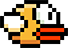

# Projet II: JSrassiK

Google Chrome Dino Easter Egg   + Flappy dino  + Javascript = JSrassiK !

## 📐 Maquettes fonctionnelles

## 🕹️ Commandes en jeu :

* Pression n'importe où sur l'écran (si ce dernier est tactile).
  * Via l'évènement [`touchstart`](https://developer.mozilla.org/fr/docs/Web/Guide/DOM/Events/Touch_events).
* Pression sur la barre d'espace.
  * Via l'évènement [`keydown`](https://developer.mozilla.org/fr/docs/Web/API/KeyboardEvent) 

