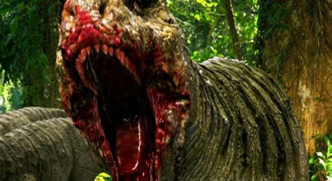
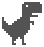
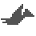
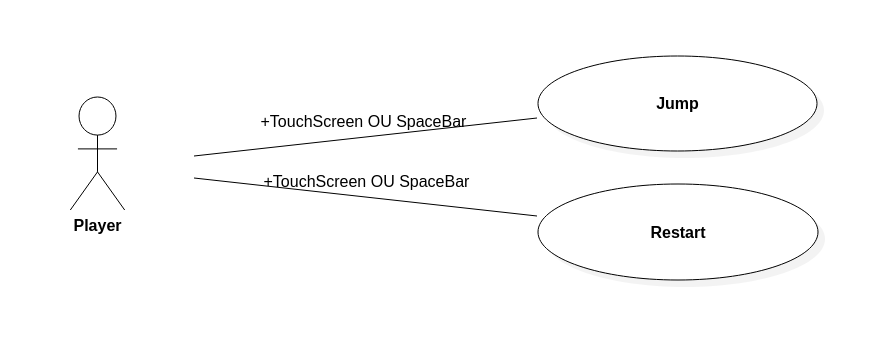
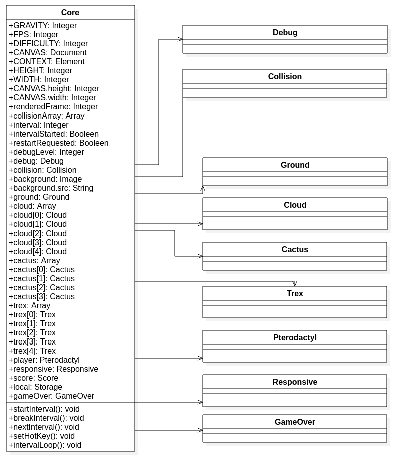
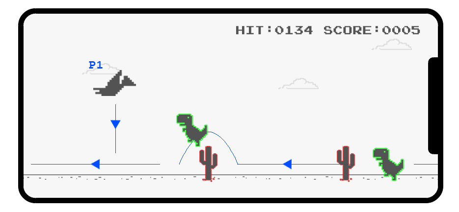
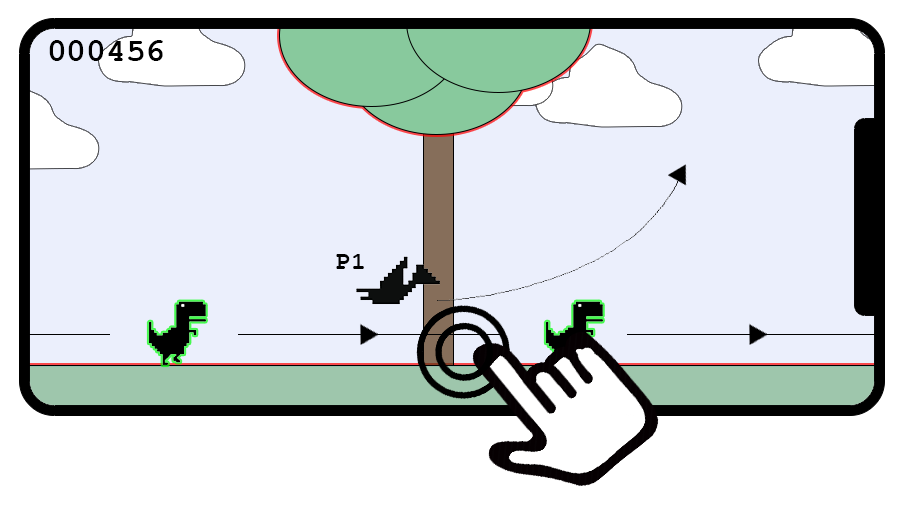
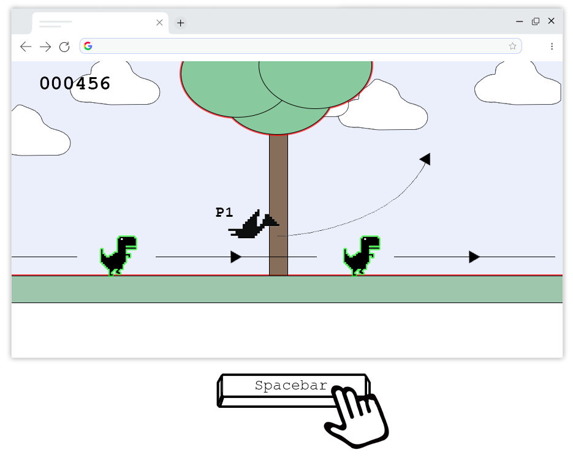
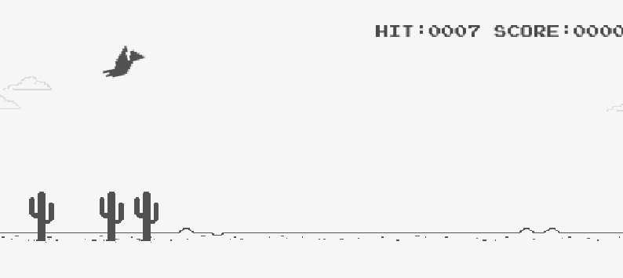

# SPL Projet II: JSrassiK ([jsrassik.xyz](http://jsrassik.xyz))

## 🗨️ Présentation du projet :

Enfant, j'aimais les dinosaures (comme beaucoup d'enfants), d'ailleurs qui n'aime pas les dinosaures ?

En attendant les progrès en clonage d’animaux préhistoriques, je propose un petit jeu dont le but est d'incarner un ptérodactyle qui chasse des tyrannosaures.

Je me suis inspiré des mécaniques de [Flappy Bird](https://flappybird.io/) et des textures ainsi que de certaines mécaniques de [Google T-rex-runner](chrome://dino/) pour imaginer ce jeu.

J'ai décidé d'utiliser les [canvas HTML](https://developer.mozilla.org/fr/docs/Web/HTML/Element/canvas) pour réalise ce projet, aucun framework n'a été utilisé.

  +  =   

## 📃 Diagrammes des cas d'utilisation et de structure :

## 📐 Maquettes fonctionnelles :

## 🕹️ Commandes en jeu :

* Pression n'importe où sur l'écran (si ce dernier est tactile).
  * Via l'évènement [`touchstart`](https://developer.mozilla.org/fr/docs/Web/Guide/DOM/Events/Touch_events).
* Pression sur la barre d'espace.
  * Via l'évènement [`keydown`](https://developer.mozilla.org/fr/docs/Web/API/KeyboardEvent) .

## 🚧 Organisation du projet :

[Semaine 1 (5 août 2019 – 9 août 2019)](https://gitlab.com/Florian-A/JSrassiK/-/milestones/1) : Maquettage du projet, organisation du début du projet, création des bases du jeu.

[Semaine 2 (11 août 2019 – 14 août 2019)](https://gitlab.com/Florian-A/JSrassiK/-/milestones/2) : Réorganisation du projet en POO, création du système de collision.

[Semaine 3 (26 août 2019 – 30 août 2019)](https://gitlab.com/Florian-A/JSrassiK/-/milestones/3) : Deuxième réorganisation du projet en POO, ajout du ptérodactyle et de ses contrôles.

[Semaine 4 (2 septembre 2019 – 6 septembre 2019)](https://gitlab.com/Florian-A/JSrassiK/-/milestones/4) : Adaptation du jeu suivant le type d'appareil (téléphone mobile ou ordinateur de bureau) et ajout du message de fin de jeu.

## 🎮 Démonstration :

